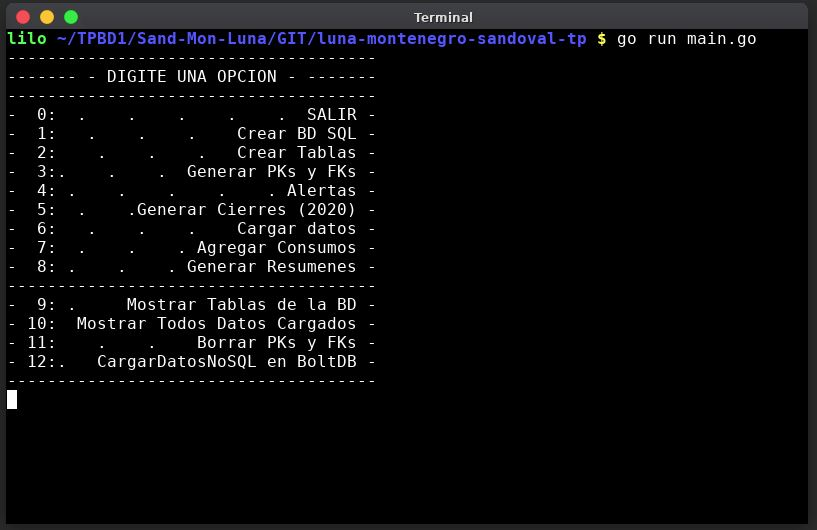

= Trabajo Práctico de Bases de Datos
Luna Nicolás <nluna190898@gmail.com>; @Montenegro Tomás <tomymontenegro1999@gmail.com>; Sandoval Maximiliano <maxisandoval98@gmail.com>;
v1, {docdate}. Docentes Hernán Rondelli y Hernán Czemerinski
:title-page:
:numbered:
:source-highlighter: coderay
:tabsize: 4

== Introducción

En el presente documento, se presentará el software de gestión de tarjetas y las funcionalidades que rodean a esta. Por medio de un modelo de bases de datos, representaremos, todos los tipos de entidades que vamos a usar, como lo es el caso de los clientes, las tarjetas, los comercios, los consumos, etc, que se verán a lo largo del desarrollo de este informe.

Las instancias centrales para su respectivo desarrollo, serán el modelo de datos, la creación propiamente dicha de la base de datos (una principal SQL y otra secundaría NoSQL para su comparativa), la carga de los datos y las distintas funcionalidades que tendrá el sistema, por medio de Stored Procedures y Triggers. Cabe destacar, que para poder representar e interactuar con el software, utilizaremos una interfaz CLI (un super menú, por medio de la terminal). 

Emplearemos las tecnologías de PostgreSQL y Go para la construcción de la aplicación.

== Descripción
En esta sección vamos a detallar cronológicamente, como fuimos estructurando y organizando el proyecto.
En primer lugar, se desarrollo los sedimentos del trabajo, estos son la base de dato relacional, las tablas (con sus atributos y tipos de datos especificados), agregamos las pks y las fks cuando correspondían. No obstante, contemplamos si es que ya existía con anterioridad, la base de datos, en el equipo que ejecute nuestro software, tomamos la decisión de sobrescribirla. 

Es importante mencionar, que, para la correcta ejecución de nuestro aplicativo, decimos instanciar una serie de datos en cada tabla, con diferentes escenarios (tanto exitosos, como operaciones invalidas), para poder testear a fondo el sistema.

Luego, por su parte, dotamos la base de datos de funcionalidad, por medio de Stored Procedures y Triggers. Los métodos que incorporamos fueron, autorización de compra, generación del resumen y alertas a clientes.

Y finalmente, a modo de comparativa, guardaremos datos de clientes, tarjetas, comercios, y compras en una base de datos NoSQL (en BoltDB), con la estructura JSON respectiva. Más adelante se analizará su comportamiento, las diferencias y similitudes que tiene con una base de datos relacional.

.Menu Principal

== Implementación
En este apartado, vamos a explicar los ejes centrales de las funcionalidades implementadas en el software que tenemos a disposición.

Cabe aclarar, que todas las opciones que tenemos disponibles para interactuar, se encuentran en el fichero “main.go”, tanto la base de datos relacional, como la no relacional. Aquí podemos acceder a las opciones de creación ambas bases de datos, setear las keys, agregar datos, entre algunas funciones que se explicaran a continuación.

Podemos acceder a las funcionalidades de autorización de compras, de la generación de resúmenes y las alertas (en el caso de los rechazos).

En el caso de la autorización de compras, la lógica que se lleva a cabo es, en primera instancia tomamos todos los datos de la tabla consumo por medio de un struct auxiliar y una query, luego los vamos recorriendo uno por uno, cada dato que estamos recorriendo analizamos su correspondiente situación (si puede ser aprobado o no), por medio de la función “autorizar_compra”, los consumos validos generan compras, los inválidos rechazos (no generan compras).  Por medio de una cadena de condicionales, el método “autorizar_compra”, analiza los distintos tipos de estados posibles, que una compra sea válida y en consecuencia autorizada o que, en los peores escenarios, la tarjeta sea invalida, el código de seguridad de la tarjeta no sea el correspondiente, la tarjeta se encuentre en estado suspendida, el plazo de vigencia este expirado, o que el consumo supere el límite de la tarjeta. 

Una vez hecha las validaciones correspondientes a cada consumo, que se encontraban pendientes de analizar, dicho consumo, pasa a ser una compra (se la inserta a la tabla de compras) o pasa a formar parte del grupo de los consumos rechazados (se lo inserta en la tabla de rechazos). En el caso de la compra, en caso de que sea insertada correctamente, entra como estado de pago en false, ya que las compras se abonan todas juntas con el cierre de la tarjeta (resumen).

En segundo lugar, en cuanto a los resúmenes la lógica es bastante simple, primero se corrobora que esa tarjeta exista, luego se basa en recorrer la tabla de tarjetas para encontrar la/s tarjeta/s que correspondan al cliente que se pasa por parámetro a la función generarResumen(). Para guardar el total del monto se usa una variable total aux y en una variable record llamada cierre_aux se guarda el cierre correspondiente a la tarjeta verificando que su terminación coincida. En la tabla cabecera se ingresan los datos correspondientes que se fueron obteniendo anteriormente y se coloca el nroresumen correspondiente a él del resumen de la tarjeta que se esté iterando. Además se recorren las compras y se buscan las que coincidan con la tarjeta y que la fecha este entre la fecha de inicio y de cierre y no esté pagada, para poder insertar los datos correspondientes en la tabla detalle.
Para finalizar se ingresa el monto total correspondiente a el resumen en la tabla cabecera. 

Finalmente, en cuanto a las alertas, la funcionalidad que rodea a las alertas se centra en que cada vez que se percibe movimientos sospechosos de alguna tarjeta, algunos datos de especial importancia son guardados en la tabla alerta; casos como cuando se percibe un rechazo de tarjeta, cuando se hacen dos compras en menos de uno o cinco minutos en comencios distintos, o cuando una tarjeta registra dos rechazos en el mismo dia.
Para la incorporación de estas necesidades funcionales se implementaron stored procedures y triggers que insertaban en la tabla alerta los datos correspondientes según la situacion, los triggers actuan en cualquiera de los casos planteados anteriormente, como por ejemplo en el caso del TRIGGER compra_rechazada() que en cuanto detecta que se inserto un valor en la tabla rechazo ejecuta una funcion que inserta nrotarjeta, nrorechazo, el dia y la hora del rechazo, entre otros datos dentro de alerta.

== Conclusiones